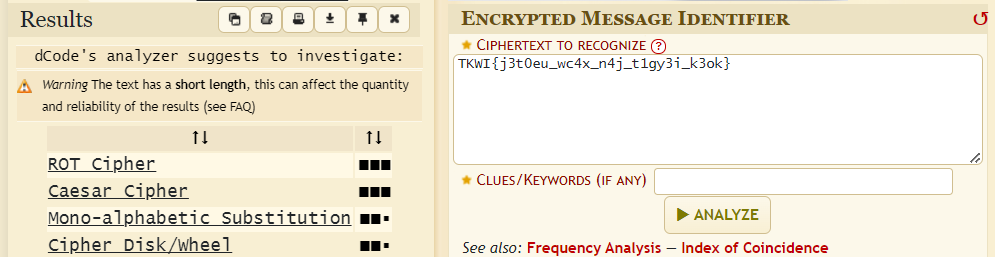
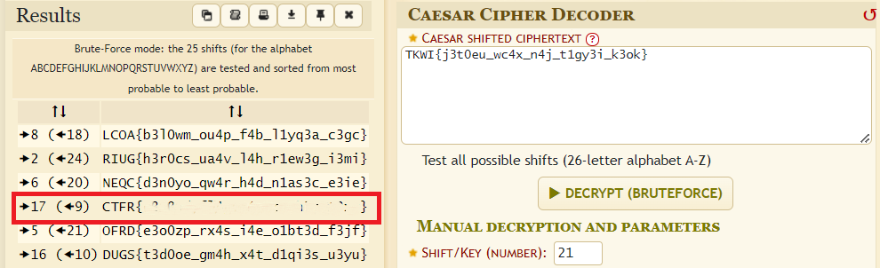

# Second Flag

### Category: Cryptography

###### Difficulty: Easy - 100 pts

Sebelumnya sudah mengenal yang namanya Encode dan Decode Yaah ? Sekarang masih sama, cuman jika kamu melihatnya challenge ini sebagai unik, maka pelajaran bagi anda :D.
Flag : TKWI{j3t0eu_wc4x_n4j_t1gy3i_k3ok}

  

### Solution:

Dikasih random string yang perlu di-decode. Untuk tau itu jenis cipher apa, bisa cek pake online tools https://www.dcode.fr/cipher-identifier

    

Bisa dilihat, ternyata itu adalah ROT/Caesar cipher [^1]. Klik tulisan "[Caesar Cipher](https://www.dcode.fr/caesar-cipher)" untuk menggunakan tools Caesar cipher encoder/decoder.
 

Lalu paste string tadi dan tinggal klik tombol bruteforce (karena kita gak tau key-nya berapa).

    

Dan ya, bisa dilihat flagnya didapat dengan menggunakan pergeseran/key = 9 (ke kanan) atau 17 (ke kiri)[^2].
 
 

### FLAG

  

  
  CTFR{s3c0nd_fl4g_w4s_c1ph3r_t3xt}

  
🏷️tags: cipher, ROT, Caesar

###### Notes.

[^1]: ROT itu sebenarnya termasuk Caesar cipher yang menggunakan pergeseran 13.
[^2]: ini mungkin agak membingungkan karena beda sama simbol yg di foto wkw yg di foto itu ngasih tau proses encodenya pake pergeseran 17 ke kanan (dari kata "CTFR{...}" → "TKWI{...}") tapi karena sekarang kita lagi nge-decode, maka arah pergeserannya dibalik. Jadinya pergeseran 17 ke kiri.
