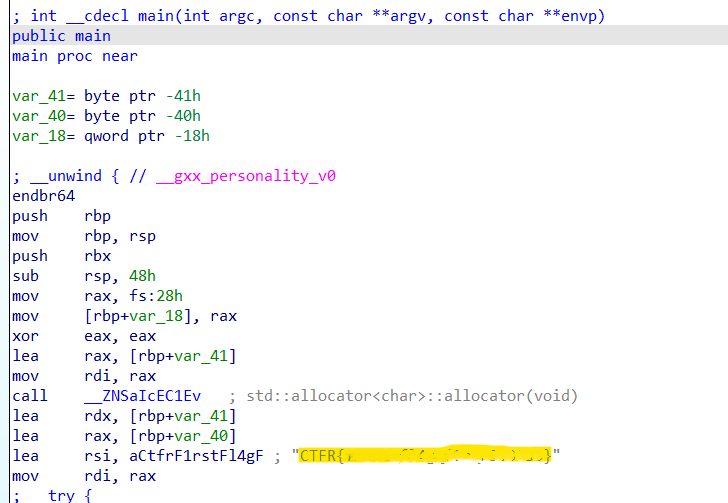

# First Reverse

### Category: Reverse Engineering

###### Difficulty: ??? - 250 pts

Pertama kali mencoba reverse ? Tools yang disarankan adalah **Ghidra**, **IDA Pro**, **Radare2**, **GDB**. Untuk menyelesaikan ini anda harus mendownload file dibawah ini

Download: [Reverse This](/CTFR/Reverse/First%20Reverse/first_reverse)
<br><br>

### Solution:

<details>
  <summary><b>TL;DR</b></summary>
  Cek pake command `strings` dan `grep` buat dapetin flag: 
  <br>
  <code>strings first_reverse | grep -i ctfr </code>
</details>

<br>

Dikasih file binary yang kalau dijalankan akan keluar output seperti berikut.

```
┌──(fr㉿LAPTOP)-[/CTFR]
└─$ ./first_reverse
Welcome to CTFR
Your Flag is somewhere inside this application
```

\*_) ⚠️Note: Saya biasanya gak langsung jalanin file ya kecuali saya yakin kalo filenya beneran aman. Kalaupun langsung buka, bukanya di VM. Di CTF, biasanya file yang dikasih aman sih tapi ada juga beberapa CTF yang beneran kasih malware (level hard dan udah dikasih warning tentunya sama author). Intinya hati-hati aja ya wkw_

Lanjut. Kalau kita cek, ini merupakan file ELF 64-bit dan _not stripped_ yang berarti informasi debug-nya masih ada.

```
┌──(fr㉿LAPTOP)-[/CTFR]
└─$ file first_reverse
first_reverse: ELF 64-bit LSB pie executable, x86-64, version 1 (SYSV), dynamically linked, interpreter /lib64/ld-linux-x86-64.so.2, BuildID[sha1]=346e6df5d783772fa9500e633c9bb5a1dbb5345c, for GNU/Linux 3.2.0, not stripped
```

Biasanya untuk not stripped binary, nama fungsi, variabel, dsb. itu masih sama seperti kode asli. Jadi kita bisa baca dan identifikasi hasil debug dengan lebih mudah dan jelas.
Langsung aja load binary-nya di debugger. Di sini saya pake IDA ya

<p align="center">
    
</p>
Setelah di-load, langsung keliatan sih flagnya hehe atau kalau mau lebih simple, bisa pake command ini terminal

`strings first_reverse | grep -i ctfr `

- `strings` menampilkan karakter printable yang ada di dalam file
- `grep` untuk melakukan pencarian text dan `-i` mengabaikan case sensitive
  <br>
  <br>

### FLAG

<details>
  <summary></summary>
  
CTFR{f1rst_fl4g_f0r_r3v3rs3}
</details>
