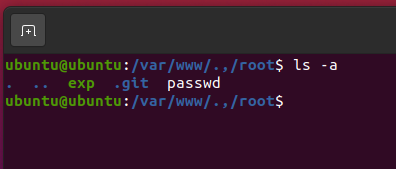
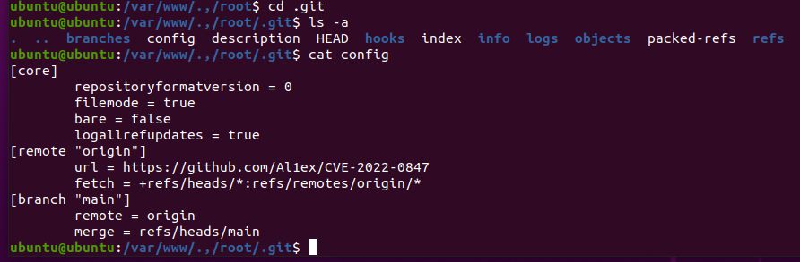

# Repo of PE File

### Category: Forensics

Original Repository of files used for privilege escalation

Format Flag: Fostifest{url}  

### Solution:

1. setelah menemukan direktori yang terdapat backdoor privilege escalation, kami analisa lagi pada folder root pada direktori /var/www/.,/root/ dengan menggunakan perintah
`ls -a`

    

2. setelah kami enter dan menemukan adanya folder .git setelah kami buka dan mengecek file nya satu persatu dan di file config kami menemukan repositori yang digunakan untuk privilege escalation yaitu dengan link https://github.com/Al1ex/CVE-2022-0847

    

3. dan kami menemukan flag nya

 
 

### FLAG

  

  
Fostifest{https://github.com/Al1ex/CVE-2022-0847}

