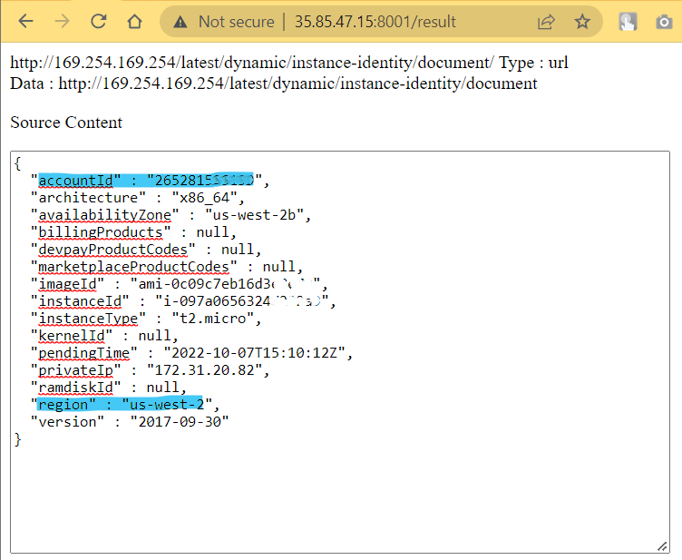
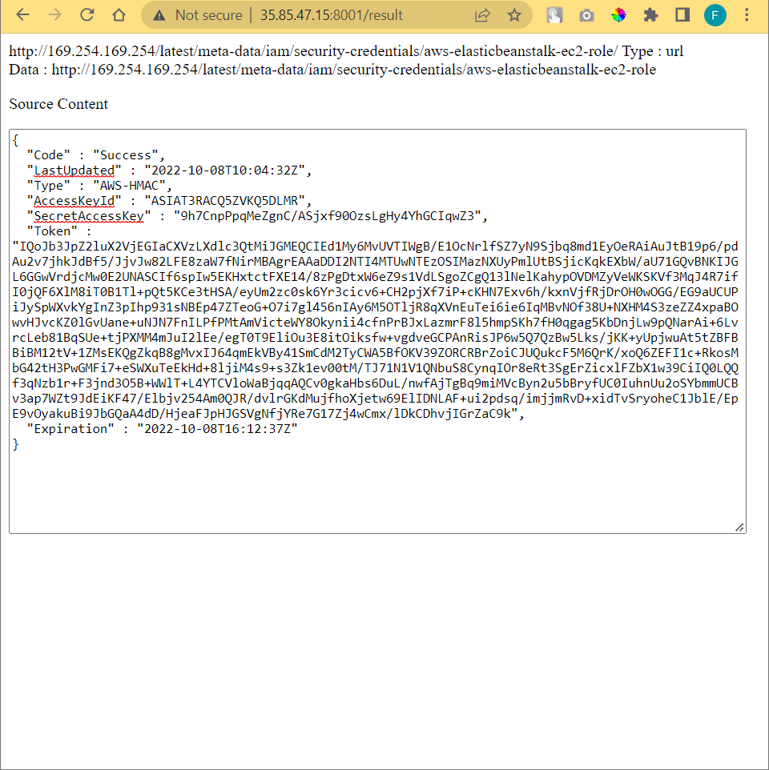

# qr-stalk

### Category: Web

http://35.85.47.15:8001/

- [app-peserta.zip](/Fostifest%202022/Web/qr-stalk/app-peserta.zip)
    

### Solution:

Terdapat sebuah tampilan web seperti berikut yang meminta kita untuk mengupload QR code.

Berdasarkan hint yang diberikan, challenge ini merupakan challenge SSRF yang menggunakan layanan AWS, khususnya Elastic Beanstalk. Menggunakan [referensi ini](https://github.com/swisskyrepo/PayloadsAllTheThings/tree/master/Server%20Side%20Request%20Forgery#ssrf-url-for-aws-elastic-beanstalk), saya membuat dua QR code. QR yang pertama berisi url (http://169.254.169.254/latest/dynamic/instance-identity/document) untuk mendapatkan accountId dan region

    
    

sedangkan QR kedua berisi url (http://169.254.169.254/latest/meta-data/iam/security-credentials/aws-elasticbeanstalk-ec2-role) yang digunakan untuk mengambil AccessKeyId, SecretAccessKey, dan Token.

    
    

Lalu akses S3 bucket dengan command
`aws s3 ls s3://elasticbeanstalk-[REGION]-[ACCOUNT_ID]/` seperti berikut.

Sebelum diakses, kita perlu melakukan konfigurasi credentials menggunakan command
`aws configure`. Berikut isi dari file credentials.

Lalu akses kembali bucketnya dan terlihat ada 1 file flag di dalam bucket tersebut.

Untuk mendapatkan isi dari file tersebut, saya menggunakan bantuan s3streamcat yang dapat diinstall menggunakan command
`pip install s3streamcat`.

 
 

### FLAG

  

  
Fostifest{5d89320ac7ab789ac1beb60c294f526e}

  
🏷️tags: SSRF, AWS

### References

- [SSRF URL for AWS Elastic Beanstalk](https://github.com/swisskyrepo/PayloadsAllTheThings/tree/master/Server%20Side%20Request%20Forgery#ssrf-url-for-aws-elastic-beanstalk)
- [AWS Configuration and credential file settings](https://docs.aws.amazon.com/cli/latest/userguide/cli-configure-files.html)
