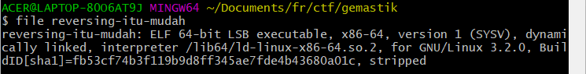
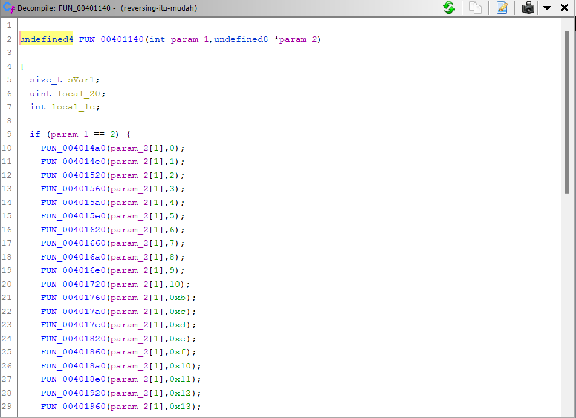
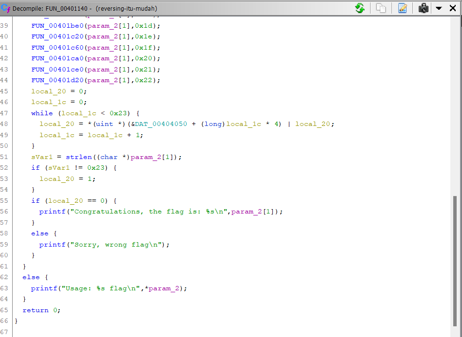
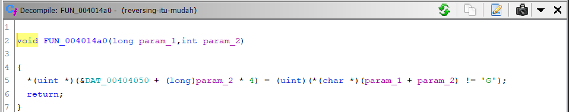
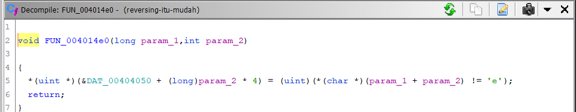
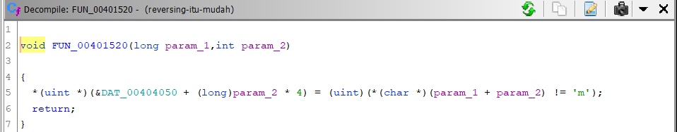
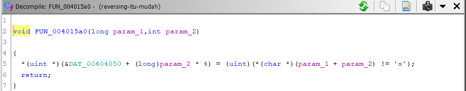
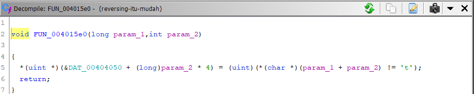
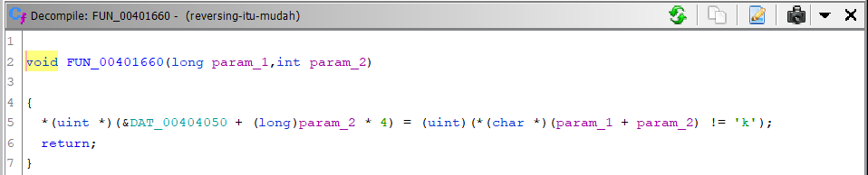

# CodeJugling

### Category: Reverse Engineering

Find the flag!

- [reversing-itu-mudah](/Gemastik%202022/Reverse/CodeJugling/reversing-itu-mudah)
    

### Solution:

Diberikan sebuah stripped binary file yang berarti informasi debugging dari program tersebut sudah dihilangkan, termasuk nama-nama fungsi yang digunakan.

    

Selanjutnya, disassembly file menggunakan Ghidra dan cek fungsi-fungsi yang ada. Terlihat ada salah satu fungsi yang melakukan pengecekan input dengan memanggil fungsi lain. Jika inputan benar, maka program akan menampilkan flag (yang tak lain dan tak bukan adalah inputan itu sendiri)

    
    

Nah sekarang kita lihat fungsi-fungsi yang digunakan untuk mengecek input tadi. Setiap fungsi tersebut ternyata melakukan perbandingan tiap karakter dari inputan dengan sebuah karakter. Kita susun saja setiap karakter yang dibandingkan tersebut dan flag pun berhasil didapatkan

\*_) karena fungsinya cukup banyak, jadi kami hanya menampilkan 8 fungsi pertama saja yang membentuk potongan kata “Gemastik” sebagai contoh✌️_

    
    
    
    
    
    
    
    

 
 

### FLAG

  

  
Gemastik2022{st45iUn_MLG_k07a_b4rU}

