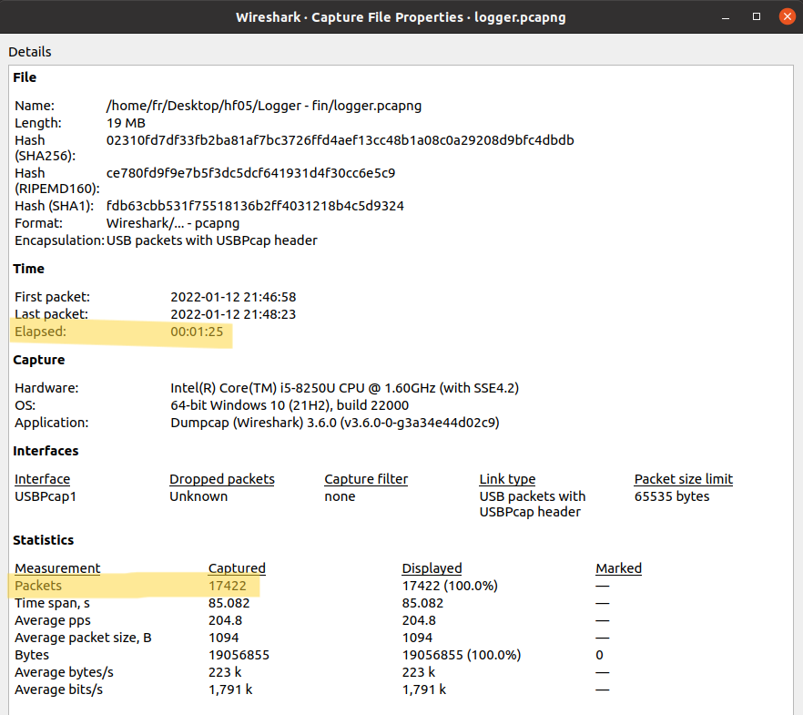
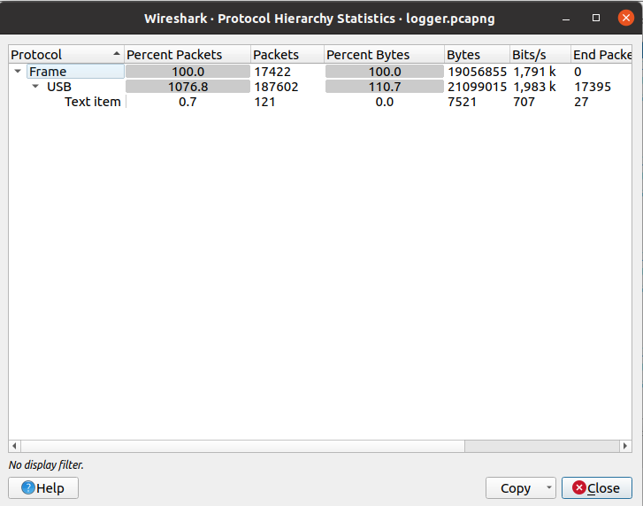
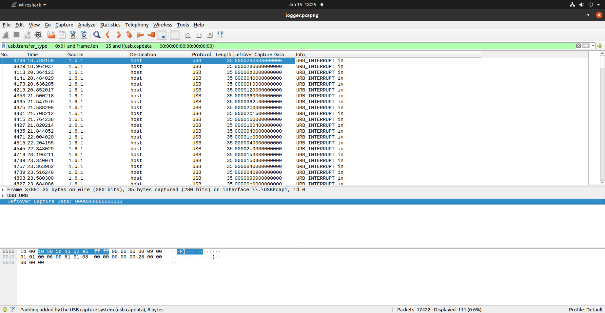
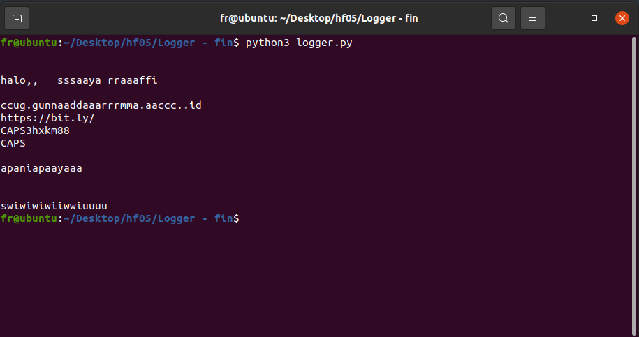
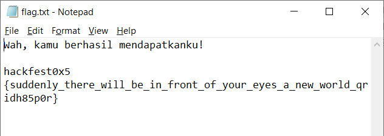

# Logger

### Category: Forensic

###### author: rafipriatna

Ada yang membajak komputerku, nih. Untung komputerku ada logger keyboardnya. Tolong bantu aku mencari tahu apa yang dilakukan pembajaknya di komputerku.
<br>
[logger.pcapng](/Hackfest0x5/Forensic/Logger/logger.pcapng)
<br><br>

### Solution:

Buka file pcapng menggunakan wireshark, lalu pilih menu Statistics \> Capture File Properties untuk melihat properti file.

<p align="center"> 
    
</p>
Di sini kita dapat melihat terdapat 17422 paket yang diterima dan waktu yang dibutuhkan yaitu selama 1 menit 25 detik. Selanjutnya, saya coba melihat Protocol Hierarchynya
<p align="center">
    
</p>
Terlihat 0,7% paket merupakan text item, lalu saya Apply as Filter. Namun setelah dilihat-lihat, tidak ada clue atau flag yang dicari.
Kemudian saya memasukkan filter berikut

```
usb.transfer_type == 0x01 and frame.len == 35 and !(usb.capdata == 00:00:00:00:00:00:00:00)
```

\*_) usb.transfer_type == 0x01 digunakan untuk menampilkan jenis transfer data Interrupt yang biasanya digunakan pada mouse dan keyboard. (0 → isochronous, 1 → interrupt, 2 → control, 3 → bulk)._ [^1] <br>

Kemudian tambahkan Leftover Capture Data sebagai kolom sehingga tampilannya menjadi seperti berikut

<p align="center">
    
</p>
Selanjutnya, export hasilnya sebagai file csv lalu jalankan command berikut untuk mendapat nilai hex dari Leftover Capture Data

```
cat log.csv | cut -d "," -f 7 | cut -d "\"" -f 2 | grep -vE "Leftover Capture Data" > hexoutput.txt
```

Kemudian saya membuat kode Python yang bisa dilihat [DI SINI](/Hackfest0x5/Forensic/Logger/logger.py)

<i>\*) referensi keymap pada kode program dapat dilihat di file [ini](https://www.usb.org/sites/default/files/documents/hut1_12v2.pdf) (halaman 53)</i>

<p align="center">
    
</p>

Bila diperhatikan outputnya, terdapat sebuah link yang jika ditulis ulang menjadi seperti berikut: https://bit.ly/3HXKM88 yang menuju ke situs Mega, layanan cloud dan hosting, dan isinya adalah file zip bernama flag. File zip tersebut memiliki file flag.txt di dalamnya. Setelah saya download dan buka filenya, ternyata file tersebut memerlukan password. Tadinya saya mau coba metode brute force tapi saya rasa hint passwordnya bisa saja sudah diberikan. Perhatikan lagi output di atas, setelah link bit.ly terdapat 2 buah string, yaitu "apaniapaayaaa" dan "swiwiwiwiiwwiuuuu". Pertama, saya coba "swiwiwiwiiwwiuuuu" tapi tidak bisa, lalu saya coba "apaniapaayaaa" dan akhirnya saya bisa mendapatkan file flag.txt-nya.

<p align="center">
    
</p>
<br><br>

### FLAG

<details>
  <summary></summary>
  
  hackfest0x5{suddenly_there_will_be_in_front_of_your_eyes_a_new_world_qridh85p0r}
</details>

<br><br>
🏷️tags: PCAP, key stroke

### References

- [Logger [easy]](https://www.youtube.com/watch?v=jT_N1g4rONo) - HackTheBox Forensics Challenge
- [Universal Serial Bus HID Usage Tables](https://www.usb.org/sites/default/files/documents/hut1_12v2.pdf) (page 53)

[^1]: [AliBawazeEer, kaizen-ctf 2018 — Reverse Engineer usb keystrok from pcap file](<https://abawazeeer.medium.com/kaizen-ctf-2018-reverse-engineer-usb-keystrok-from-pcap-file-2412351679f4#:~:text=reading%20about%20USB%20reveals%20that%20there%20are%20four%20basic%20modes%20of%20transfer%20for%20USB%3A%20The%20%E2%80%98transfer_type%E2%80%99%20specifies%20if%20this%20transfer%20is%20isochronous%20(0)%2C%20interrupt%20(1)%2C%20control%20(2)%20or%20bulk%20(3).>)
