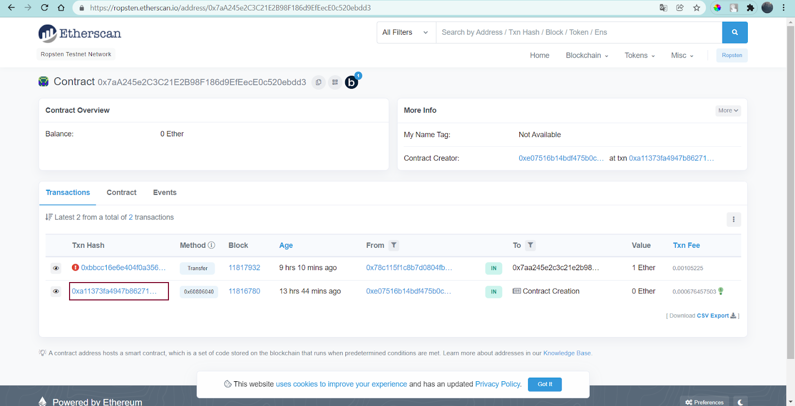
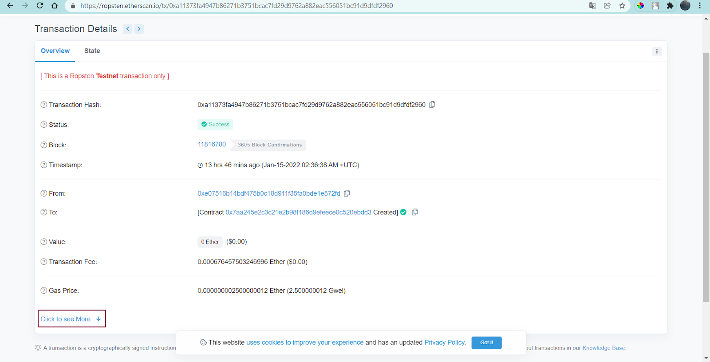
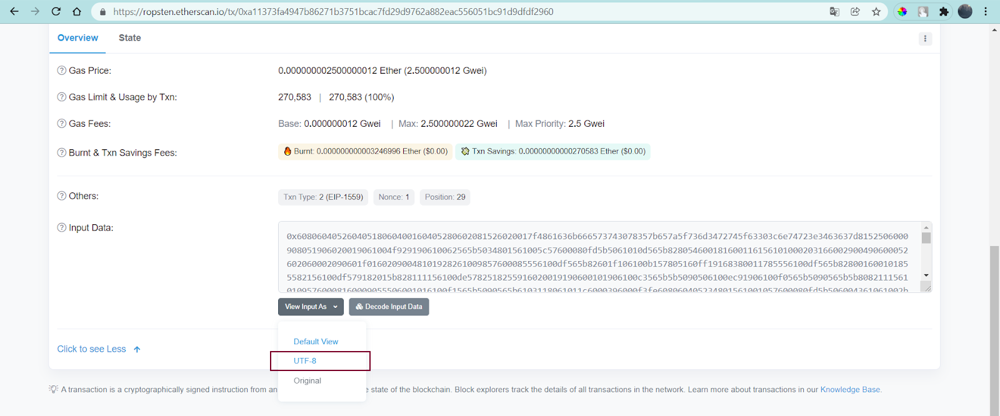
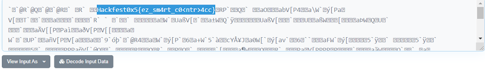

# seETHe

### Category: Forensic

###### author: HoneyFun

Smart Contract? thats interesting stuffs..

Anyway Here's my address : <b>0x7aA245e2C3C21E2B98F186d9EfEecE0c520ebdd3</b> (ropsten)

Sorry but i have to go, Just _ <b>call_me</b> _ later okay?

flag : Hackfest0x5{}
  

### Solution:

Pertama, saya coba googling dengan keyword "ropsten ctf" dan menemukan web [ini](https://ropsten.etherscan.io/token/0xf80d3e80b0fafdf21016a4cae93a5a6c8d195354). Lalu saya masukkan address yang tertera (0x7aA245e2C3C21E2B98F186d9EfEecE0c520ebdd3) di kolom pencarian dan muncul tampilan seperti berikut

    

Kemudian saya klik Txn Hash dari transaksi pertama, lalu pilih Click to see More.

    

    

Di bagian halaman paling bawah, terdapat kolom input data. Kemudian saya ganti view-nya menjadi UTF-8 dan flag pun berhasil didapatkan

    

  

### FLAG

  

  
  Hackfest0x5{ez_sm4rt_c0\<ntr\>4cc}

